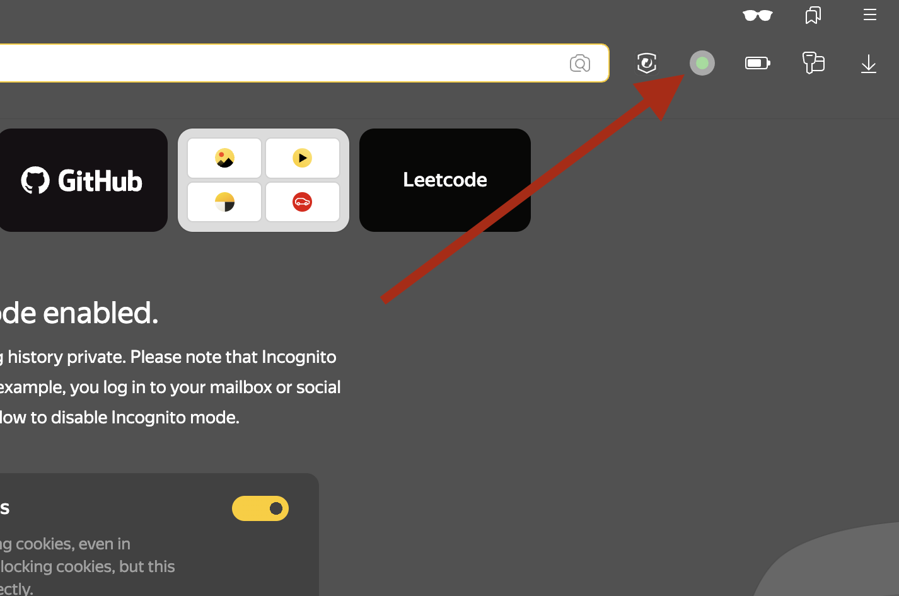
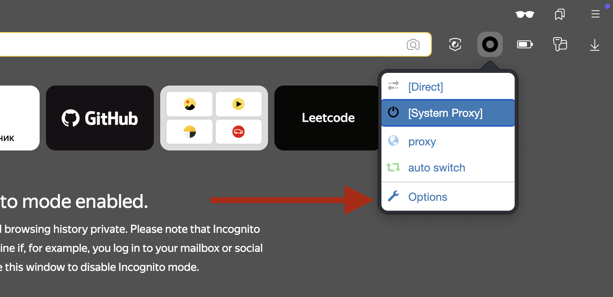
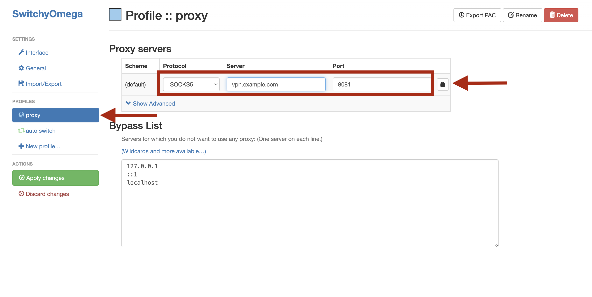
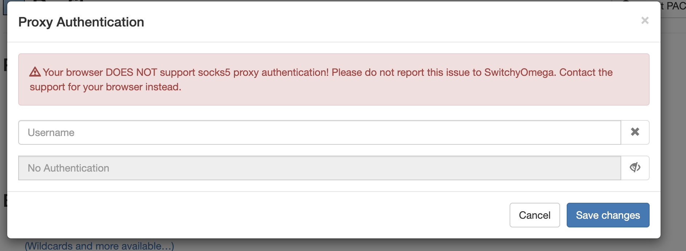
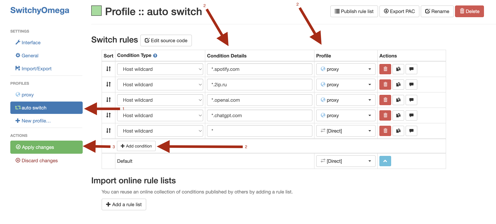
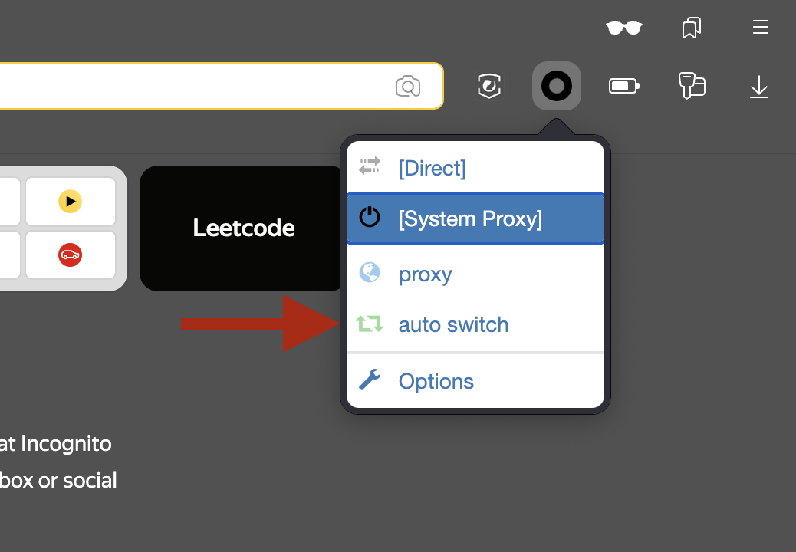

# 🛡️ Proxy + Google Chrome / Yandex Browser

## 📥 Установка расширения
1. Установите расширение [Proxy SwitchyOmega](https://chromewebstore.google.com/detail/proxy-switchyomega/padekgcemlokbadohgkifijomclgjgif) 
   → Нажмите "Добавить в Chrome".
1.1 Для firefox [ZeroOmega--Proxy SwitchyOmega V3](https://addons.mozilla.org/ru/firefox/addon/zeroomega/)

  
  

---

## ⚙️ Настройка прокси
1. Нажмите на иконку расширения → **Options** → **Proxy**.
2. Введите данные (взяты из 3X-UI или вашего провайдера):
   - **Protocol**: `SOCKS5`
   - **Server**: `ваш_сервер`
   - **Port**: `ваш_порт`
3. Нажмите 🔒 **Padlock** для ввода логина/пароля.

  
  

---

## 🛣️ Настройка правил маршрутизации
1. Перейдите во вкладку **Auto Switch**.
2. Добавьте правила:

   | Condition Type     | Condition Details       | Profile | Actions         |
   |--------------------|-------------------------|---------|------------------|
   | Host wildcard      | `*.spotify.com`         | proxy   | 🗑️ 📋 ⬇️        |
   | Host wildcard      | `*.2ip.ru`              | proxy   | 🗑️ 📋 ⬇️        |
   | Host wildcard      | `*.openai.com`          | proxy   | 🗑️️ 📋 ⬇️      |
   | ...                | ...                     | ...     | ...             |
   | **Default**        |                         | Direct  | ⬆️              |

3. Нажмите **Apply changes**.

  

📥 [Файл с готовыми правилами](https://github.com/Fgeeha/must-first/raw/Master/Proxy%2BGoogle%20Chrome/file/OmegaRules_auto_switch.sorl)

---

## ✅ Проверка работы
1. Выберите режим **Auto Switch** в расширении.
2. Проверьте IP на сайтах:
    - Работает через прокси: [2ip.ru](https://2ip.ru)
    - Прямое соединение: [Reg.ru](https://www.reg.ru/web-tools/myip)

  

